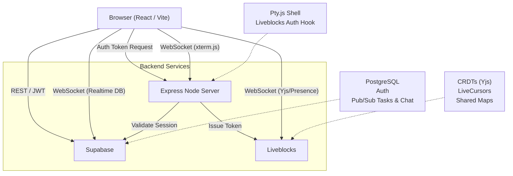
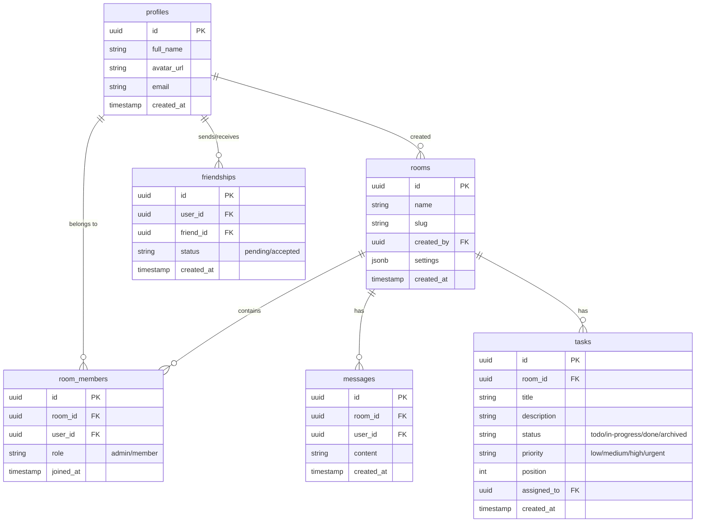
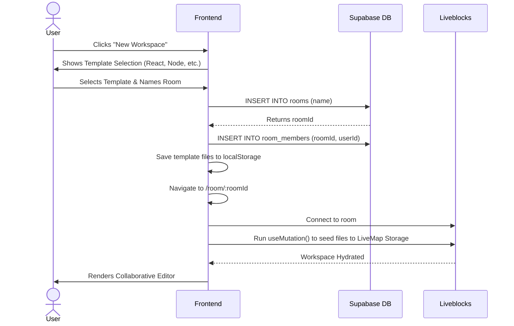
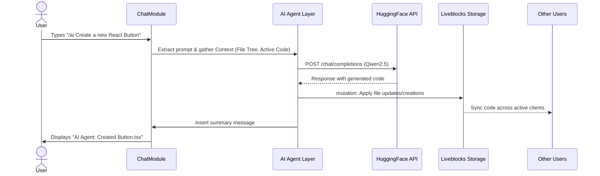

# 🚀 CollabCodeHub — Complete Project Documentation

CollabCodeHub is a unified, real-time collaborative coding environment built for modern remote teams. It brings together code editing, task management, whiteboarding, AI assistance, and terminal access into a single, seamless workspace.

---

## 1. Executive Summary

### 🌟 Vision Statement
To replace the fragmented modern developer toolchain (VS Code + Jira + Miro + Slack + ChatGPT) with a single, collaborative, real-time workspace where teams can brainstorm, code, and ship software seamlessly together.

### 👥 Target Audience
- **Remote Development Teams:** Software engineering teams distributed across regions needing synchronous collaboration.
- **Freelancers & Agencies:** Teams working dynamically with clients requiring transparent project visibility.
- **Bootcamp Students & Educators:** Instructors and learners who need pair-programming environments without complicated environment setups.

### 🎯 Core Needs Addressed
- **Context Switching Penalty:** Developers lose focus switching between Jira, GitHub, Slack, and VS Code. CollabCodeHub centralizes these.
- **Pair Programming Friction:** "My environment acts differently than yours." Shared, browser-based environments eliminate the "It works on my machine" problem.
- **AI Tool Sprawl:** Keeping a separate tab open for ChatGPT ruins flow. AI is integrated directly into the workspace (AIPulse & inline autocomplete).

### 💎 Value Proposition & Products
We deliver a **"Multiplayer Workspace OS"**.
- **The Engine:** Real-time sync engine powered by Liveblocks (CRDTs) and Supabase (WebSockets).
- **The Tools:** Monaco-based Collaborative Editor, draggable Kanban Board, Infinite Canvas Whiteboard, and a shared Express-powered Terminal.
- **The Intelligence:** Qwen2.5/Gemini AI agents embedded into the chat and editor contexts to write, refactor, and review code collaboratively.

---

## 2. Product Roadmap

### ✅ Phase 1: Core Collaboration (Current State)
- Real-time code editor with live cursors and presence indicators.
- Live Kanban task board with drag-and-drop.
- Real-time chat module with DiceBear avatars.
- Collaborative Whiteboard canvas for architecture planning.
- Shared terminal execution environment.
- Room Templates for fast project scaffolding (React, Node, Python, etc.).

### 🤖 Phase 2: AI & Intelligence Upgrade (In Progress)
- **AI Tab Autocomplete:** Inline code completion powered by HuggingFace/Qwen models.
- **AI Meeting Notes:** Post-huddle auto-summarization and task generation.
- **Dashboard Insights:** AI-driven project wellness checks on the main dashboard.

### 💰 Phase 3: SaaS Monetization Layer
- Implement Free / Pro / Team pricing tiers.
- Stripe checkout integration.
- Hardware/Compute limits scaling (Free = 1GB storage, Pro = Unlimited).

### 📈 Phase 4: Scale, Growth & Retention
- One-Click Deployments (Vercel integration).
- GitHub Repo ↔ Workspace bi-directional sync.
- Embeddable read-only workspaces for documentation and blogs.

---

## 3. System Architecture

The application relies on a modern serverless/edge stack mixed with a dedicated WebSocket server for terminal access.

---

## 4. Database Schema (Supabase)

Below is the Entity-Relationship (ER) diagram representing our PostgreSQL schema.

### Security
Authentication is handled via Supabase Auth. We utilize strict **Row Level Security (RLS)** in PostgreSQL. Access to `rooms`, `tasks`, and `messages` is restricted by a custom PL/pgSQL function `is_room_member()` which verifies the user exists in `room_members` for the queried `room_id`.

---

## 5. Core User Flows

### Flow 1: Room Creation & Workspace Seeding

### Flow 2: AI Assistance via Chat / Terminal

---

## 6. Detailed Feature Breakdown

1. **Dashboard:** Central hub showing active workspaces, global activity feed, and friend management.
2. **Apple-glass Dock:** Left-side navigation bar inside the room for seamlessly switching between the Editor, Task Board, Whiteboard, and Chat without leaving the context.
3. **Activity Feed Panel:** A real-time log capturing "who did what" globally within the workspace (file changes, task updates, members joining).
4. **Code Runner / Terminal:** A shared console where users can execute browser-native Javascript code sandboxes or communicate with the backend proxy process.
5. **AI Pulse:** A floating, context-aware AI assistant (`Ctrl+I`) that can read the current file tree and answer architectural questions.
6. **Command Palette (`Ctrl+K`):** Quick-action menu to navigate the app rapidly.

---

## 7. Technology Stack Checklist

- **Frontend:** React 18, Vite, Tailwind CSS, Lucide Icons, React Router DOM.
- **State & Collaboration:** Liveblocks, Yjs (for CRDT text synchronization).
- **Code Editor:** Monaco Editor (`@monaco-editor/react`).
- **Backend & Database:** Supabase (PostgreSQL, Auth, Realtime APIs).
- **Socket Server:** Node.js, Express, `ws` (WebSockets), `node-pty` (Terminal Integration).
- **AI Integration:** Together AI / HuggingFace Inference API (Qwen2.5/Gemini models).
- **Drag & Drop:** `@hello-pangea/dnd` (Task Board).
