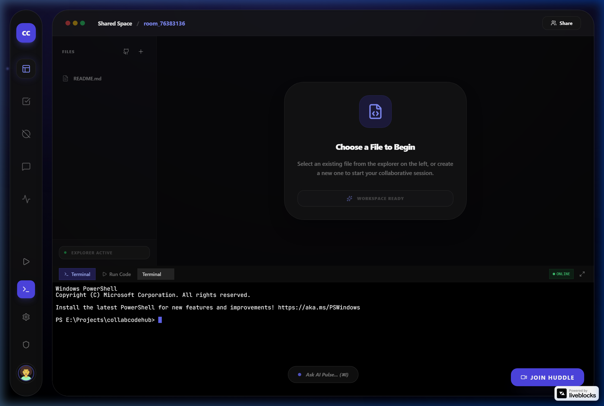
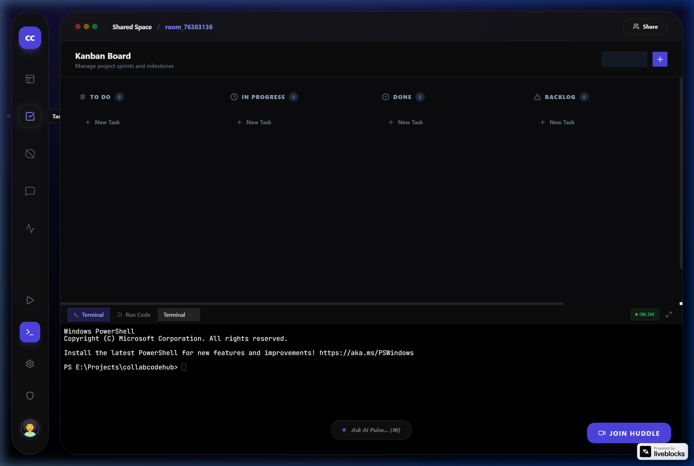
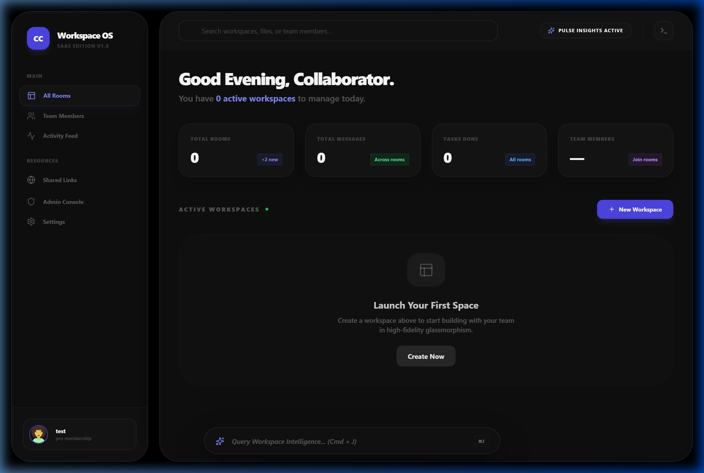
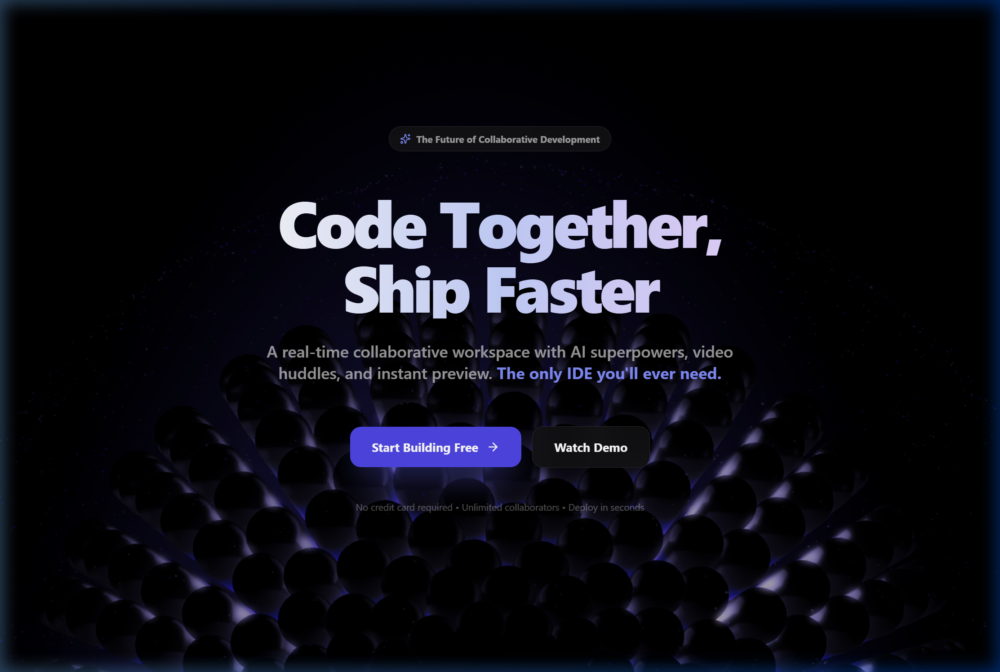
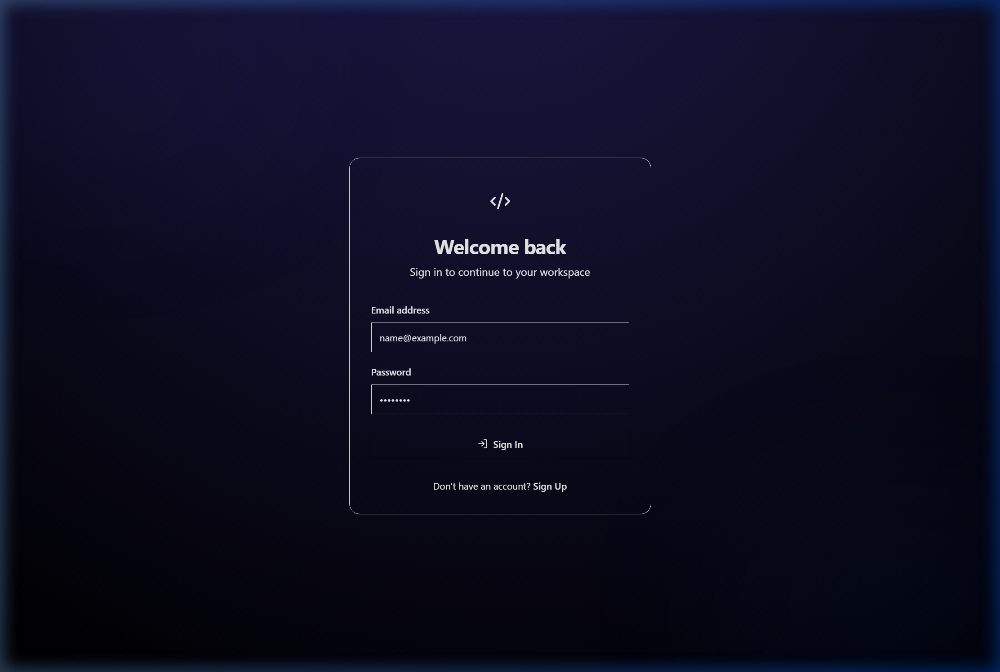
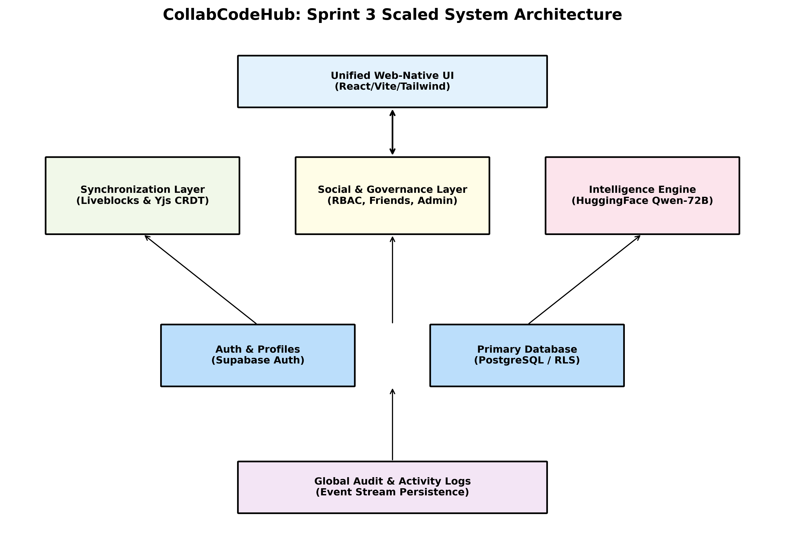

<div align="center">

  <h1>🚀 CollabCodeHub</h1>
  <p><b>Next-Generation Real-Time Collaborative Development Platform</b></p>

  <p>
    An all-in-one cloud workspace featuring real-time CRDT code editing, interactive web terminals, agile task boards, collaborative whiteboards, live spatial voice huddles, and context-aware AI assistance.
  </p>

  <!-- Badges -->
  <p>
    <a href="https://react.dev/"></a>
    <a href="https://www.typescriptlang.org/"></a>
    <a href="https://vitejs.dev/"></a>
    <a href="https://tailwindcss.com/"></a>
    <a href="https://liveblocks.io/"></a>
    <a href="https://supabase.com/"></a>
    <a href="https://microsoft.github.io/monaco-editor/"></a>
    <a href="LICENSE"></a>
  </p>

  <br />

  

</div>

<br />

---

## ✨ Key Highlights

**CollabCodeHub** is designed for modern development teams, remote pair programming, code reviews, live technical interviews, and agile sprint collaboration. It eliminates the friction of context switching by bringing code editing, execution, whiteboard diagramming, task tracking, voice communication, and AI intelligence into a single unified browser experience.

- ⚡ **Zero-Latency CRDT Synchronization**: Simultaneous multi-user editing with conflict-free replicated data types powered by **Yjs** & **Liveblocks**.
- 🐚 **Integrated Web Terminal Execution**: Run real scripts and commands inside an **Xterm.js** terminal linked to a **Node.js PTY execution backend**.
- 🤖 **Context-Aware AI Pulse Assistant**: Integrated **Gemini AI** model providing instant code generation, bug fixing, explanations, and inline chat.
- 🎨 **Infinite Canvas Whiteboard**: Real-time collaborative visual drawing, component architecture diagramming, and brainstorming tool.
- 📋 **Agile Sprint Kanban Board**: Full drag-and-drop task tracking system with live status syncing, status tags, and task assignments.
- 🎙️ **Spatial Voice Huddles & Presence**: Instant voice channels with live avatar indicator bubbles, speaker wave animations, and presence pointers.
- 👁️ **Sandboxed Live Web Preview**: Real-time iframe sandbox with instant auto-reload for HTML, CSS, and JS projects.
- 🔐 **Enterprise Security & Auth**: Secure authentication and database policies powered by **Supabase** with Row-Level Security (RLS).

---

## 📸 Visual Showcase & Feature Tour

### 1. 🛠️ Interactive Collaborative Workspace
> *Monaco Editor with multi-cursor live tracking, file explorer, live terminal execution, audio huddles, and AI Pulse assistant.*


<br />

### 2. 📋 Agile Task Kanban Board
> *Full-featured sprint management with drag-and-drop task movement, priority tags, assignees, and real-time status updates.*



<br />

### 3. 📊 Centralized Project Dashboard
> *Manage collaboration rooms, inspect recent activity feeds, search workspaces, and connect with teammates.*



<br />

### 4. 🎨 Landing Page & Secure Authentication Flow
> *Modern glassmorphic interface built with dynamic 3D Spline elements and Supabase OAuth & Magic Link authentication.*

<div align="center">
  
  
</div>

---

## 🏗️ System Architecture

CollabCodeHub utilizes a microservices-inspired client-server architecture designed for high availability, low latency, and real-time synchronization.

<div align="center">
  
</div>

### Architecture Breakdown:
1. **Frontend Presentation Layer**: Built with **React 19**, **TypeScript**, and **Tailwind CSS**. Manages state, Monaco/CodeMirror editor instances, Xterm terminal widgets, and HTML5 Canvas whiteboards.
2. **Real-time Sync Engine**: Utilizes **Liveblocks WebSocket infrastructure** paired with **Yjs CRDT document instances** for concurrent multi-file state updates.
3. **Execution Backend (PTY Server)**: An **Express.js + WebSocket server** spawning node/bash PTY child processes to output execution logs back to client terminals.
4. **Data Persistence & Auth**: **Supabase PostgreSQL** holding room metadata, task board states, user profiles, and activity logs under strict Row Level Security (RLS).
5. **AI Services Integration**: **Google Gemini API** for intelligent code suggestion, refactoring, code explanation, and workspace context assistance.

---

## 🛠️ Technology Stack

| Domain | Technology / Library | Description |
| :--- | :--- | :--- |
| **Frontend Framework** | `React 19`, `TypeScript 5.9`, `Vite 7` | Ultra-fast client app with Hot Module Replacement |
| **Routing & Navigation** | `React Router 7` | Declarative client-side routing & page states |
| **Styling & Icons** | `Tailwind CSS`, `Lucide React` | Modern glassmorphism UI tokens & responsive layouts |
| **Code Editor** | `@monaco-editor/react`, `CodeMirror 6` | Full-featured code editor with syntax highlighting & auto-complete |
| **Real-Time CRDT Sync** | `@liveblocks/client`, `@liveblocks/yjs`, `Yjs` | Zero-conflict real-time document & presence synchronization |
| **Terminal & Execution** | `Xterm.js`, `xterm-addon-fit`, `WebSocket` | In-browser interactive shell connected to Node execution server |
| **Database & Auth** | `@supabase/supabase-js`, `PostgreSQL` | Secure auth, database persistence, and Row-Level Security (RLS) |
| **Task Management** | `@hello-pangea/dnd` | Smooth drag-and-drop task Kanban operations |
| **AI Intelligence** | `Google Gemini API`, `Hugging Face API` | Context-aware AI assistant (`AIPulse.tsx`) |
| **Backend Runtime** | `Node.js`, `Express 5`, `tsx`, `ws` | WebSocket PTY execution server and Liveblocks auth endpoints |

---

## ⚡ Quickstart & Installation Guide

### Prerequisites
Make sure you have the following installed on your machine:
- **Node.js** (v18.0.0 or higher)
- **npm** (v9.0.0 or higher) or **pnpm** / **yarn**

### 1. Clone the Repository
```bash
git clone https://github.com/padalarohit12/CollabCodeHub.git
cd CollabCodeHub
```

### 2. Install Dependencies
```bash
npm install
```

### 3. Environment Setup
Create a `.env` file in the root directory by copying the sample template:
```bash
cp .env.example .env
```
Fill in your API credentials in `.env`:
```env
VITE_SUPABASE_URL=https://your-supabase-project.supabase.co
VITE_SUPABASE_ANON_KEY=your_supabase_anon_key

VITE_LIVEBLOCKS_PUBLIC_KEY=pk_dev_your_liveblocks_public_key
LIVEBLOCKS_SECRET_KEY=sk_dev_your_liveblocks_secret_key

VITE_GEMINI_API_KEY=your_gemini_api_key
```

### 4. Run the Development Environment
Launch both the **Vite Frontend Client** and **Node.js Execution Server** concurrently:
```bash
npm run dev:all
```

- **Frontend Client**: Runs on `http://localhost:5173`
- **Execution Backend**: Runs on `http://localhost:3001`

---

## 📜 Available Scripts

| Script | Command | Description |
| :--- | :--- | :--- |
| `npm run dev` | `vite` | Starts the frontend dev server |
| `npm run server` | `tsx server/index.ts` | Starts the Express & WebSocket terminal backend |
| `npm run dev:all` | `concurrently ...` | Starts both client and backend simultaneously |
| `npm run build` | `tsc -b && vite build` | Typechecks and builds the production bundle |
| `npm run preview` | `vite preview` | Previews the built production app locally |
| `npm run lint` | `eslint .` | Runs ESLint code quality checks |

---

## 📁 Repository Structure

```
CollabCodeHub/
├── assets/
│   └── readme/                 # High-resolution screenshots & showcase assets
├── public/                     # Static public assets
├── server/                     # Express & WebSocket backend for PTY execution
│   └── index.ts                # Server startup & WebSocket handlers
├── src/
│   ├── components/             # Reusable UI & Feature components
│   │   ├── AIPulse.tsx         # AI Assistance widget
│   │   ├── CollaborativeEditor.tsx # Monaco & Yjs CRDT integration
│   │   ├── CollaborativeTerminal.tsx # Xterm.js real-time shell
│   │   ├── TaskBoard.tsx       # Drag-and-drop Kanban board
│   │   ├── Whiteboard.tsx      # Real-time visual canvas
│   │   ├── HuddleBubbles.tsx   # Spatial voice avatar indicators
│   │   └── LivePreview.tsx     # In-browser HTML sandbox iframe
│   ├── contexts/               # React Context Providers (Auth, Theme, Room)
│   ├── pages/                  # Page routes (Landing, Auth, Dashboard, Workspace)
│   ├── lib/                    # Supabase client & utility functions
│   ├── App.tsx                 # Root application routing
│   └── main.tsx                # Client entry point
├── supabase_schema.sql         # Supabase database schema & RLS setup
├── package.json                # Project dependencies and script scripts
└── vite.config.ts              # Vite configuration
```

---

## 🤝 Contributing

Contributions are welcome! If you'd like to improve CollabCodeHub or add new features:
1. Fork the project repository
2. Create your feature branch (`git checkout -b feature/AmazingFeature`)
3. Commit your changes (`git commit -m 'Add some AmazingFeature'`)
4. Push to the branch (`git checkout -b feature/AmazingFeature` & `git push origin feature/AmazingFeature`)
5. Open a Pull Request

---

## 📄 License

Distributed under the **MIT License**. See `LICENSE` for more information.

<div align="center">
  <br />
  <p>Made with ❤️ by <b><a href="https://github.com/padalarohit12">Rohit Padala</a></b></p>
</div>
